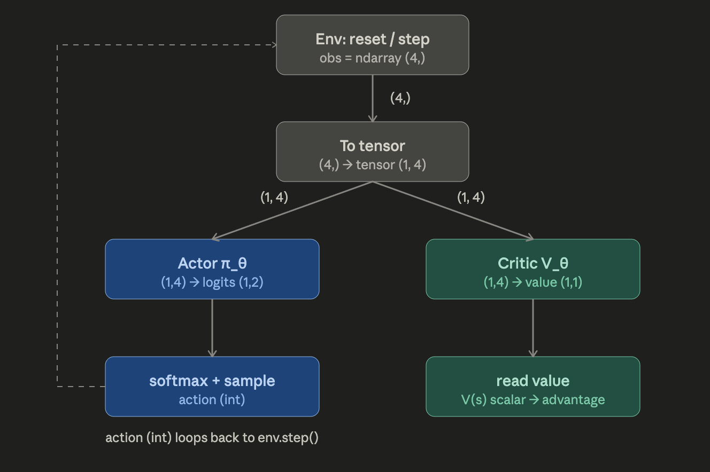
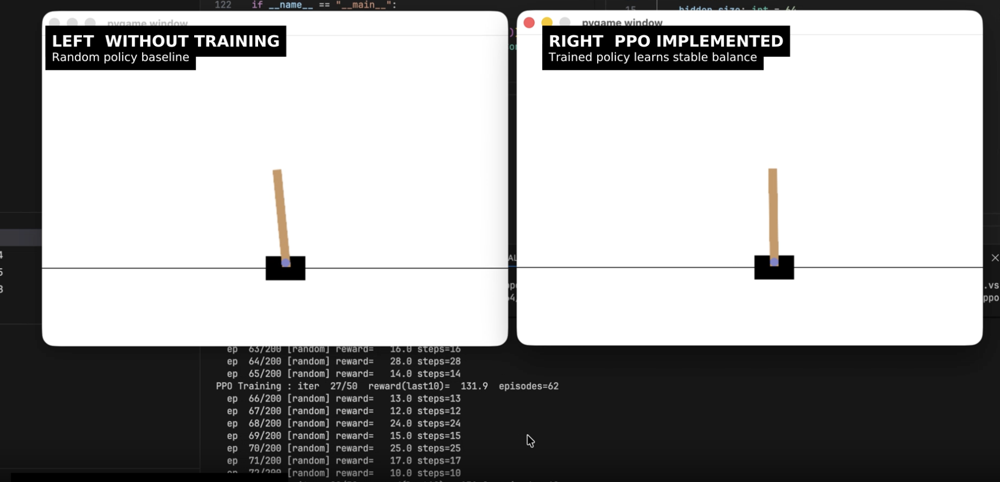

# PPO (Proximal Policy Optimization) Implementation

A minimal, readable PPO (Proximal Policy Optimization) implementation for
discrete-action Gymnasium environments

The design keeps one responsibility per file. The **actor** turns an
observation into an action distribution; the **critic** turns the same
observation into a value estimate `V(s)`; the **env** is a thin Gymnasium
wrapper; and **main** is the orchestrator that collects rollouts, computes
GAE advantages, and runs the clipped PPO update. Nothing about the RL
algorithm lives inside the networks — they are pure function approximators
that answer "which action?" and "how good is this state?".

## Flowchart of PPO (Eg: CartPole)


Data shapes: a single observation is `(obs_dim,)`; networks receive it
batched — `(1, obs_dim)` during rollout, `(B, obs_dim)` during the update.
`obs_dim` and `act_dim` are read from the env's spaces, so swapping
environments needs no code changes.

## Demo (Eg: CartPole)

[](./docs/cartpole_policy_comparison_final.mp4)

## How to run

### Setup

The project is `poetry` manager setup. Therefore, to install all required dependencies, run this

```bash
poetry lock && poetry install
```

> Make sure the specific venv python interpreter is selected.

### Run and Train with defaults (CartPole-v1):

Using Debugger (Any python file), for example: open and select `./ppo_impl/cartpole/cartpole_ochestrator.py` file and run it on debug mode, follow same process for other games
